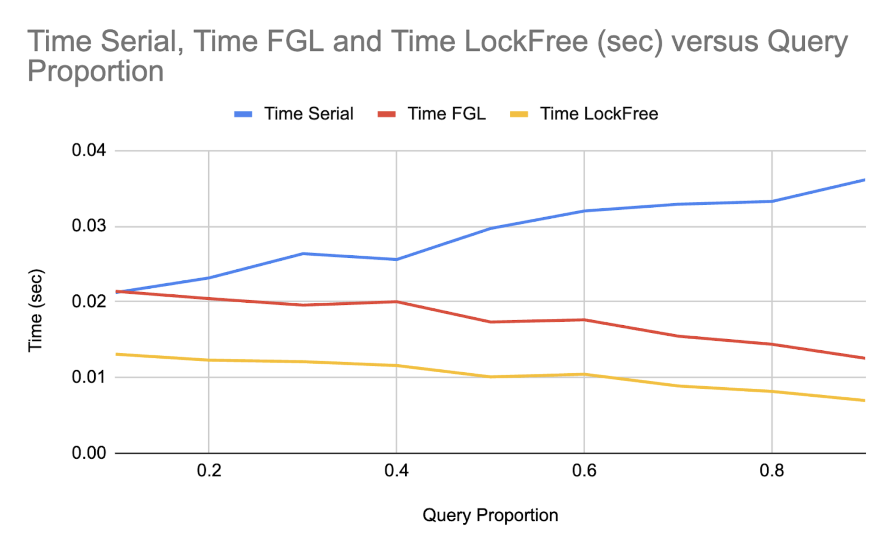

Title: Parallelizing Range Queries with Lock-Free SegTrees  
Authors: Sebastian Dounchis, Neo Lopez

[Final Project Report PDF](docs/Final_Report_418.pdf)

[Milestone Report PDF](docs/Milestone%20Report%20418.pdf)

[Project Proposal PDF](docs/Project%20Proposal%20418.pdf)

[Jump to Project Proposal](#project-proposal)

# Milestone Report

## Updated Schedule
- As of 4/15: We completed all but one of the goals we set for 3/28, 4/4, 4/11, and 4/15
  - Complete: file structure including Makefile, five distinct implementations (serial, coarse-grained locking, fine-grained locking, CUDA prefix sum, lock-free), testfile generating script, initial rounds of testing
  - Incomplete: CUDA manual range queries implementation
- By 4/18: Finish CUDA-based implementations, begin drafting final report, experiment with false-sharing optimizations and prefetching optimizations
  - Maybe, if this doesn't take too long, we will try to implement prefix sums range querying and manual range querying with ISPC tasks
  - This would allow comparison of performance versus number of threads, which we wouldn't achieve with CUDA
  - Neo will focus on final report, Seb will focus on implementation, though we work together for almost every task in this project and will blend roles
- By 4/22: Continue on final report, finalize all implementations (serial, coarse, fine, lockfree, CUDA prefix sums, CUDA manual range query) for testing
  - This includes generalizing the code for non-constant combining functions
  - Neo will focus on final report, Seb will focus on completing implementations
- By 4/25: Complete testing on PSC machines for important graphs, begin drafting final poster
  - The specific graphs we will test for are in the “Poster Session” Section
  - Neo will focus on testing, Seb will focus on poster ideation
- By 4/28: Finalize final report and submit, finalize poster, have practice run-throughs for presentation
- By 4/29: Present our final poster

## Progress Summary
In terms of comparing implementations, we created a main function to parse input arguments and
a test-case generation function, callable by executables under our file structure. As of April 15th
we’ve completed serial, coarse-grained locking, fine-grained locking, and compare and swap
implementations for range queries and updates for the addition operator. This required us to
consider how to process overlaid updates and queries, which present problems relatable to the
memory consistency problem. We decided to slightly change the problem into one where
multiple updates happen then multiple queries happen, as this allows for much more parallelism.
Additionally, the fine-grained locking and compare and swap implementations have a “levels
saved” optimization to determine how many levels we compute with locks versus how many
levels we propagate serially.

We also added a CUDA implementation that uses a prefix sum optimization to significantly
increase the speed of queries. However, an update to index i in this implementation must
increment the prefix sums of all subsequent indices, an O(n) problem. Using CUDA threads, we
have significantly sped this up, allocating each increment to lanes within warps. The CUDA
implementation still struggles, requiring further optimization to compete with the serial
implementation.

## Goal Alignment
In terms of staying aligned with our goals, we have successfully finalized implementations for serial, coarse-grained locking, fine-grained locking, and lock-free seg trees. We are also confident that we will be able to optimize our current CUDA prefix-sum implementation along with creating a CUDA manual range query approach. This set of implementations will contain parallelization within and across operations, another deliverable met from our project proposal. We have already explored different types of padding within our lock-free and fine-grained locking implementations without success. We will further explore padding to avoid false-sharing. Our other “hope to achieve” goals, prefetching and combining update paths, remain as hope to achieve goals. We did touch on combining update paths in the form of the levels saved optimization, though this is not the combination of update paths we had originally thought of. Our main priority after finalizing all implementations will be to rigorously test and analyze each approach across a variety of configurations.

With respect to our testing goals, we have performed initial testing of our finalized implementations as shown in the preliminary results section. We also created a test file generator with the following testfile configuration options: array size, query ratio, number of operations, range of update values about zero (so that we could keep the total sum small), and size of operation chunks. The final option, size of operation chunks, was created to replicate the real-world phenomenon of many updates or queries occurring in a row, or in a chunk. Repetitive operations were needed for parallelism, otherwise the problem is difficult to parallelize with frequently overlapping operations (i.e. some sequence uququququq…). While it may be difficult to test each specific metric we aimed for in our project proposal, we expect to eventually reach all testing goals and will provide an in-depth analysis of approach trade-offs, bottlenecks, and more. 

Goals to Hit Before Poster Session:
- Finalize CUDA implementations
- Compare padding vs no padding for lock-free and fine-grained locking approaches
- Rigorously test, analyze, and discuss performance
  - Our preliminary testing is an introduction to the type of tests we will run and discussions we will provide in our final project
  - Research and utilize in-depth profiling techniques to compare implementation performance across different workloads
    - Including but not limited to: idle time, synchronization stalls, computation time, cache miss stalls
  - Complete testing and analysis on the GHC and PSC machines
    - Compare performances across higher thread counts

## Poster Session
At the poster session, we intend to show many different graphs and justify each trend with a verbal analysis of the tradeoffs relevant in the graph. The most important graphs we’ve identified so far are:

1. Time versus proportion of queries/updates for all implementations with each implementation being a different line
2. Speedup versus number of threads for the fine and lock free implementations
3. Speedup versus number of top levels handled sequentially for fine and lock free implementations

Once we implement non-constant combining functions, we could create the same three graphs for these types of workloads as well. Thus, we’d be considering all implementations over all types of combining functions and all query/update proportions. We’ll refer to the graphs as graphs (1), (2), and (3) in the preliminary results.

## Preliminary Results
We show some preliminary results for the implementations we have so far, recognizing that these implementations could be optimized (in terms of hyperparameter selection, ideal thread count, etc.) before the final report.

We omit the CUDA prefix sum implementation from these graphs as we’re not happy with the time it takes as of now and have barely optimized its implementation.

Here is a graph of (1). We omit the time of the coarse grained implementation (locking over the entire SegTree each operation) since it can be no better than a serial implementation due to lock overhead and because it skewed the y-axis, making other trends seem less significant.

As the number of queries goes up, the time taken goes down for the FGL and Lock Free implementations and up for the serial implementation. Here, we use 8 threads for both implementations. Queries are read-only operations, so multiple threads can handle queries faster by overlapping them without needing to lock, hence the improvement over the serial implementation for both methods. The lock free implementation is faster than the fine-grained implementation as expected, since we don’t need locks.

Here we showcase (3), the speedup over one level saved for different numbers of levels saved. Levels saved, k, is a hyperparameter that tells the implementation to propagate updates up until the top k levels, then propagate updates serially, level by level, from the kth level upwards.

The input we were giving has 18 levels (array size is 262144 = 2^18), and the number of threads we used is 8. In this case, the ideal number of levels saved seems to be 14. The general “happy medium” trend reflects a tradeoff between (a) the overhead due to locks, which is higher if the number of levels saved is smaller, and (b) the cost of serially propagating updates upwards, which is smaller if the number of levels saved is smaller. We expect that the best choice for this hyperparameter depends on the number of threads, since this is a problem with contention, as well as the size of the array, since that determines the possible number of levels saved. This is something we’ll have to explore in later testing.

Here we showcase the scalability of each solution, graph (2). Note that this scalability is largely affected by the number of levels saved hyperparameter, since levels closer to the top exhibit the most contention. We decided to save 14 levels, consistent with the preliminary results related to the number of levels saved.

We see our solution isn’t very close to scaling optimally, though we note it scaled even worse before we added the levels saved hyperparameter. We will never be able to scale optimally because it’s impossible for all updates to occur at once without locks or compare and swap (which will introduce overhead) without risking lost updates. We would like to improve the speedup from 4 to 8 threads as here, we begin to see a smaller slope (in the speedup graph). This could be done with more experimentation with the levels saved parameter, including making it dependent on the number of threads.

## Concerning Issues
The only concerning issue we face is figuring out how to use profiling techniques to analyze metrics such as idle time, synchronization stalls, computation time, and cache miss stalls. We will use a combination of online research, office hours, and, if necessary, reaching out to instructors to solve this problem. 

# Project Proposal

## Summary
We are going to implement parallelized range queries and updates with coarse-grained locking, fine-grained locking and lock-free SegTrees. Then, we will analyze their performance on a diverse set of workloads, adding and comparing optimizations such as prefetching, vectorized instructions, and multi-threaded collaborative updates versus distributing updates across processors.

## Background
Given an array A, a range query on that array asks about a property of some continuous range of that data from A[i] to A[j-1]. For example, one might be interested in the sum of the numbers from i to j. One approach to supporting such a range query is to loop over the range and compute the sum itself. A secondary approach is to precompute prefix sums and return the sum over a range as the difference A[j-1] - A[i-1], provided i > 0. Regardless of the approach, we would like to be able to support updating the array and re-querying. In the first approach, updates can be done in constant time, whereas in the second approach, updates must persist to all prefixes.

This gives the first approach, a manual range query, an O(1) update and an O(n) range query and the second approach, prefix queries, an O(n) update and an O(1) range query. In workloads where one operation is extremely rare, this may suffice, however, in workloads where updates and range queries are roughly balanced, then both operations are O(n) on average.

SegTrees implement O(log n) updates and range queries by using an array to represent a complete tree. On the bottom level is the array, on the next level is half the nodes of the lower level with sub computations A[0] + A[1], A[2] + A[3], and so on, and this pattern continues to the root of the tree which contains the result of the query on the entire array. Updates of array positions include updating all nodes on the path from leaf to tree that contain the array position. Range queries involve determining which blocks compose the range query.

Figure 1: How a SegTree is represented as a tree and as an array.

With updates corresponding to traversing a tree from leaf to root, there is opportunity for parallelizing updates by having multiple processors perform separate updates along separate paths. Alternatively, parallelism could be attained by having multiple processors update separate array positions for a single update. Moreover, since range queries are read-only, multiple processors should be able to range query at the same time, provided no updates take place between subsequent range queries. These ideas present many opportunities for parallelism, as there are many ways to perform collaborative or per-processor updates.

Inspiration taken from the [15-451](https://www.cs.cmu.edu/~15451-f24/lectures/lecture06-range-queries.pdf) textbook.

## The Challenge
Since the memory accesses and modifications depend on the specifics of the operation (an update or a range query), the depth and width of necessary accesses and changes is unpredictable. Therefore, we will need to make decisions in work allocation, notably across sub-trees versus across operations, and synchronization of shared resources, such as the top, most commonly modified nodes, to scale performance with the number of processors. 

With two update paths having the ability to cross at their lowest common ancestors in the SegTree, parallelizing updates requires a careful implementation to ensure updates to nodes in the SegTree are not lost due to memory operations not being atomic. This is where coarse-grained locking, fine-grained locking, and a lock-free implementation of the SegTree data-structure are important. Additionally, if range queries are overlapped with updates, we may not see the intended design of a range query after an update if the update has not finished before a query commences. This provides a challenge in dealing with the different operations quickly.

Figure 2: Update paths crossing. We need to ensure atomic updates to ensure updates aren’t lost.

At the same time, updates may not overlap at all, at least until the top few layers. In this case, there are opportunities for prefetching up the SegTree path so that later computations can be performed more efficiently. If two update paths cross and invalidate each other’s prefetched data, perhaps consolidating update paths could be beneficial.

Due to the array structure of SegTrees, cache coherence will be a prominent issue to deal with, decreasing performance as false-sharing causes our communication-to-computation ratio to increase. Opportunities for false sharing include the top few layers, where the nodes are clumped at the back of the SegTree array and in between each layer, where the rightmost node is adjacent in the array to the leftmost node of the next level. This specific challenge forces us to consider approaches like padding node layers to optimize performance. Further, we will need to hypothesize and test different padding strategies such as only post-layer padding versus different frequencies of intra-layer padding.

Each of the challenges presented might have a different “best” implementation dependent on the specific workload, i.e., update-heavy workloads, range query-heavy workloads, balanced workloads, and non-constant associative combination functions (instead of simply addition). This is something we will have to analyze and explore within our project.

For example, in workloads that are extremely update-heavy and extremely range query-heavy, perhaps it is better to implement the first two approaches we identified using CUDA technologies and vectorized instructions. This is something we hope to analyze within our project.

## Resources
To create the initial serialized SegTree operation algorithms, we will use a small amount of starter code from the 451 textbook. In creating our file structure and parallel code, we will use previous assignments to guide us (i.e. creating the makefile, parsing files filled with operations). Additionally, we aim to analyze performance across different workloads, and we might use motivation from common characteristics of commercial workloads to drive our interest in how our optimizations could theoretically drive real-world improvements. We may also need to create a script to create trace files.

For testing, we will use the GHC machines to test at lower thread counts and experiment with the PSC machines for a wider range of thread counts.

## Goals and Deliverables
**Plan to Achieve:**  
- Coarse-grained locking, fine-grained locking, and lock-free implementations of SegTrees  
- CUDA-based implementations of the manual range query and prefix range query approaches  
- Parallel SegTree implementations distributing work within operations, across operations, and both within and across operations  
- In-depth analysis of each parallel range query implementations on workloads of varying proportions of updates versus queries and workloads with non-constant update functions  
  - Comparing idle time, synchronization stalls, computation time, and cache miss stalls  
  - Graphing time of each implementation as a function of proportion of updates to queries within the workload (keeping the number of threads constant)  
- In-depth analysis of performance of each implementation with different thread counts  

**Hope to Achieve:**  
- False-sharing optimizations: exploring high-frequency intra-level padding, low-frequency intra-level padding, and inter-level padding  
- Prefetching optimizations: exploring different levels of aggression of prefetching  
- Combining update paths: exploring the effect of consolidating update paths for processors who cross update paths

## Platform Choice
We will use GHC machines to test and debug our implementations due to our immediate access to compute on these clusters. We will then use PSC machines on our experiments to provide consistent measurements of performance across thread counts varying from 1 to 256. 

Our code will be written in C++ due to our familiarity with implementing parallel algorithms with this language. To create test files with specific proportions of updates to queries, we will use Python.

## Schedule
- By 3/28: Create file structure, including makefile
- By 4/4: Implement coarse-grained and fine-grained locking queries and updates using SegTrees
- By 4/11: Implement lock-free SegTrees and CUDA-based manual range queries and prefix sum range queries
- By 4/15: Create a script for generating test files and perform initial testing on each implementation
- By 4/18: Begin drafting final report, experiment with false-sharing optimizations and prefetching optimizations
- By 4/25: Complete testing on PSC machines for important graphs, begin drafting final poster
- By 4/28: Finalize final report and submit, finalize poster, have practice run-throughs for presentation
- By 4/29: Present our final poster

## Updated Schedule (As of 4/15)
- As of 4/15: We have completed all the goals we set for 3/28, 4/4, 4/11, and 4/15 except for CUDA-based manual range queries and prefix sum range queries
- By 4/18: Finish CUDA-based implementations, begin drafting final report, experiment with false-sharing optimizations and prefetching optimizations
  - Maybe, if this doesn't take too long, we will try to implement prefix sums range querying and manual range querying with ISPC tasks
  - This would allow comparison of performance versus number of threads, which we wouldn't achieve with CUDA
  - Neo will focus on final report, Seb will focus on implementation, though we work together and will blend roles
- By 4/22: Continue on final report, finalize all implementations (serial, coarse, fine, lockfree, CUDA prefix sums, CUDA manual range query) for testing
  - This includes generalizing the code for non-constant combining functions
  - Neo will focus on final report, Seb will focus on completing implementations
- By 4/25: Complete testing on PSC machines for important graphs, begin drafting final poster
  - Testing will include creating graphs for the following:
      - Time versus proportion of queries/updates for all implementations (each implementation would be a different line)
      - Speedup versus number of threads for fine and lockfree implementations
        - Could have different speedup graphs for different proportions of queries and updates
      - Speedup versus number of top levels handled sequentially (an optimization due to high top level lock contention) for fine and lockfree implementations
        - Could have different speedup graphs for different proportions of queries and updates
      - Same three graphs as above, but for non-constant combining functions
  - Neo will focus on testing, Seb will focus on poster ideation
- By 4/28: Finalize final report and submit, finalize poster, have practice run-throughs for presentation
- By 4/29: Present our final poster

